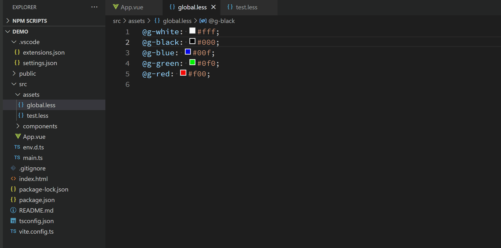
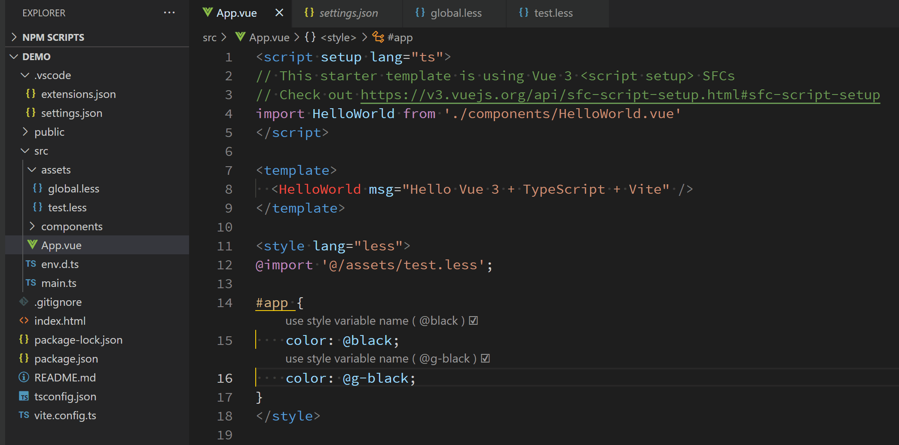

<!-- omit in toc -->
# Style all in one

<!-- omit in toc -->
## 目录

- [主要功能](#主要功能)
- [支持的语言](#支持的语言)
- [使用示例](#使用示例)
- [配置项](#配置项)

## 主要功能

- [x] 变量提示（vue 文件内也可提示）
- [x] 反向索引（根据颜色值索引对应的变量名）
- [x] 跳转到变量定义处
- [x] 点击 CodeLens 切换变量值与变量名

## 支持的语言

- [x] vue
- [x] css/pcss/postcss
- [x] less
- [x] scss/sass
- [ ] stylish（暂不支持，后续看使用情况，有需要再支持）

## 使用示例

- 变量索引



- 为 CSS 变量替换提供更加简便的方式



- 转到定义


## 配置项

```js
{
    // 配置全局变量表
    // 支持相对路径、绝对路径、npm 包、路径别名等
    // 支持文件、目录
    // 匹配顺序为：路径别名 > npm 包 > 相对路径（相对 workspace 根目录）
    "style-all-in-one.global-style": [
        "@/style/",
        "./global.less",
        "@sxf/sf-theme/dist/brand.less"     // npm 包无需写 node_modules
    ],

    // 配置项目使用的路径别名
    "style-all-in-one.path-aliases": {
        "@": "src",     // 路径末尾会自动添加 `/`，可省略不写
        "@atest/style-all-in-one": "src/style-all-in-one/alias-path/"   // 目录需要相对于 workspace 跟目录，或者使用绝对路径
    }
}
```
